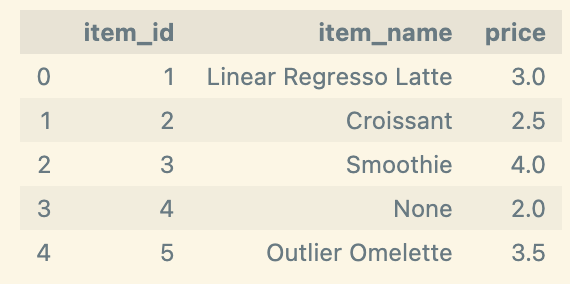
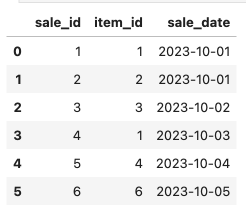
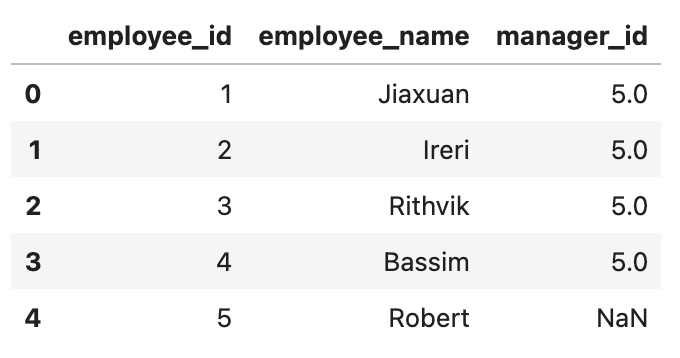
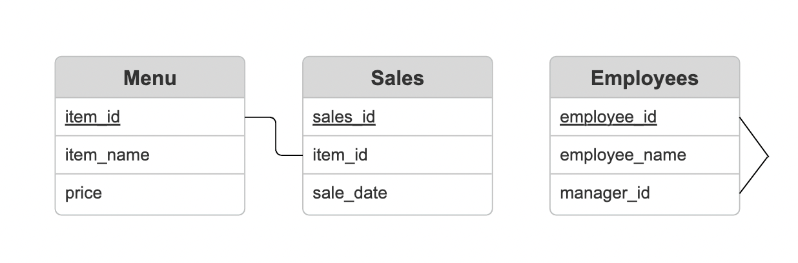
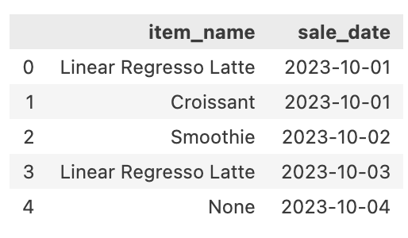
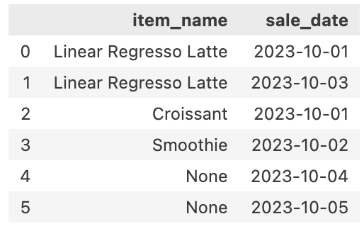
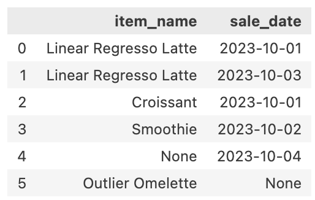
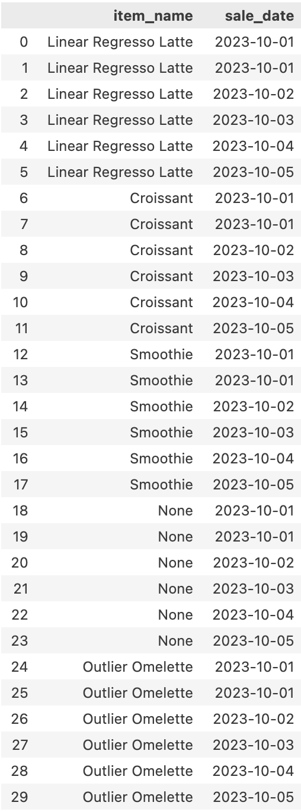
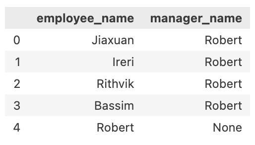

# Relational Joins Demo
<p align="center">
  
</p>


Welcome to the **MSDS Cafe** with only a few products for every student in a hurry.

With the purpose of providing an introductory example to join operations within a database. The provided data allows easy visualitation of the different types of joins with edge cases for each of them.

## The Data
Our database consists of three tables: 

### Menu

The items currently offered by the cafe. Identified by their unique `id`, we also have the `name` of the product and their corresponding `price`.  

* Contains new items that have not been sold yet



### Sales

Records for every sale identified by their unique `id`, when the sale happened: `sale_date`, and what items were bought: `item_id`. 

* This table has a new item sold that isn't in the menu table yet



### Employees

Employee records with their unique `employee_id`, the `employee_name`, and the manager's `employee_id` for that employee.  



The ER diagram for this database is as follows:
  

  
Primary keys for each table are underlined.  

## Start Using it

The demo can be found [here](relational_joins_demo.ipynb). With a separate [notebook](create_data.ipynb) for the creation of tables with corresponding data. This allows easy manipulation of tables for testing different values. Location of both notebooks under same directory will ensure proper running.

The format of the demo allows for manipulation of queries in SQL within a Python environment. It starts by importing libraries:

```
# Import libraries
import pandas as pd
from sqlalchemy import create_engine, text
from IPython.display import display
```

It then creates the tables and defines the function to be able to write queries in SQL that can be run within out cells.

```
# Create the tables
files_and_tables = {
    'data/menu.csv': 'menu_table',
    'data/sales.csv': 'sales_table',
    'data/employees.csv': 'employees_table'
}

for filepath, tablename in files_and_tables.items():
    df = pd.read_csv(filepath)
    df.to_sql(tablename, engine, index=False)

# Fn to display results from query
def query_to_result(query):
    wrapped_query = text(query)
    result = pd.read_sql_query(wrapped_query, engine)
    display(result)
```

## Inner Join

A helpful case for an inner join is if we wanted a more simple way to check for transactions per day, only showing the item bought and day of sale. This can be done through the *join* of `sales` and `menu` tables.



## Left/Right Join

Providing results for extra information given a leading table, we can choose the direction of the join. An example is provided for same tables but joins from both left and right providing different results.
* Right


* Left


## Cross Join

A cross join, shows all possible combinations between tables. 



## Self Join

A simple but powerful example is provided to see employees and corresponding manager by name, this given that the information is stored in the same table.



## Your Turn

This notebook allows modifications to the queries for any other cases you want to test. The sky is the limit!
